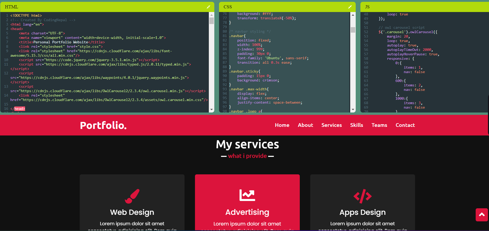

# CodePen.io - A CodePen Clone


Welcome to CodePen.io, a React-based web application that serves as a CodePen clone, allowing developers to write and share HTML, CSS, and JavaScript code snippets in an interactive and collaborative environment.
## Demo
You can find a live demo of CodePen.io at https://codepen-io.onrender.com/.



## Features

- Write and preview HTML, CSS, and JavaScript code in real-time.
- Customize the layout with resizable editor and preview panes.
- Supports popular libraries and frameworks (e.g., React, Vue.js, Bootstrap).
- Like, comment, and fork other users' pens.
- Dark mode for a comfortable coding experience at night.


## Getting Started

To run CodePen.io locally on your machine, follow these steps:

## Dependencies

Before running the application, make sure you have the following dependencies installed:

- Node.js (https://nodejs.org) - version 14 or higher
- npm (Node Package Manager) - version 6 or higher

## Installation

1. Clone this repository to your local machine:

```bash
git clone https://github.com/your-username/codepen.io.git
cd codepen.io
